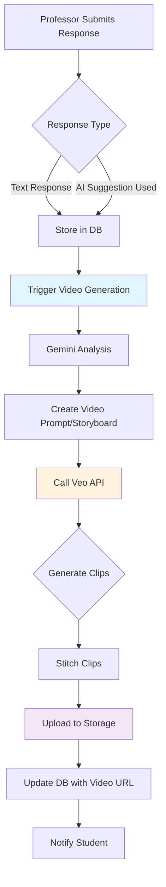

# Video Generation for Escalation Responses

## Overview

Implement automatic video generation using Google's Gemini Veo API to convert text escalation responses (both professor-written and AI-suggested) into short, engaging video messages. Videos are generated automatically when responses are submitted and processed asynchronously due to Veo's generation time.

## Architecture




## Database Changes

### Migration: Add video fields to escalations table

Create `supabase/migrations/010_add_video_to_escalations.sql`:

```sql
-- Add video storage fields to escalations table
ALTER TABLE escalations
ADD COLUMN IF NOT EXISTS video_url TEXT,
ADD COLUMN IF NOT EXISTS video_generated_at TIMESTAMP WITH TIME ZONE,
ADD COLUMN IF NOT EXISTS video_generation_status TEXT DEFAULT 'pending' 
  CHECK (video_generation_status IN ('pending', 'processing', 'completed', 'failed'));

-- Add index for video generation status queries
CREATE INDEX IF NOT EXISTS idx_escalations_video_status 
ON escalations(video_generation_status) 
WHERE video_generation_status IN ('pending', 'processing');
```


### Storage Setup

- Configure Supabase Storage bucket `escalation-videos` for video files
- Set RLS policies: Professors can upload, students can view their own escalations' videos

## Implementation Tasks

### Task 1: Video Generation Service

**File**: `lib/video/generator.ts`Create video generation service that:

1. Takes escalation response text, student name, and escalation context
2. Uses Gemini to analyze text and create video storyboard/prompt
3. Calls Veo API to generate 4-8 second video clips
4. Stitches multiple clips together if needed (target: 15-30 seconds)
5. Returns video buffer for upload

**Key Functions**:

```typescript
async function generateVideoPrompt(responseText: string, studentName: string, context: EscalationContext): Promise<string>
async function generateVideoClips(prompt: string, style?: VideoStyle): Promise<VideoClip[]>
async function stitchVideoClips(clips: VideoClip[]): Promise<Buffer>
```

**Veo API Integration**:

- Use Google AI Studio API or Vertex AI for Veo 3.1
- Support MOCK_MODE: return placeholder video or skip generation
- Handle Veo API limits (quota, rate limits, regional restrictions)

### Task 2: Video Storage Service

**File**: `lib/video/storage.ts`Create storage service for Supabase Storage:

1. Upload video buffer to `escalation-videos` bucket
2. Generate signed URL for secure access
3. Handle storage errors and cleanup

**Key Functions**:

```typescript
async function uploadVideo(buffer: Buffer, escalationId: string): Promise<string>
async function getVideoUrl(escalationId: string): Promise<string | null>
async function deleteVideo(escalationId: string): Promise<void>
```


### Task 3: Video Generation API Endpoint

**File**: `app/api/escalations/[id]/generate-video/route.ts`Create async video generation endpoint:

1. Authenticate professor
2. Verify escalation ownership
3. Trigger video generation (async processing)
4. Return job ID for status polling

**Endpoint**: `POST /api/escalations/:id/generate-video`**Request Body**:

```typescript
{
  responseText: string,  // The response text to convert to video
  studentName?: string,  // Optional: for personalization
}
```

**Response**:

```typescript
{
  success: boolean,
  jobId: string,
  status: 'pending' | 'processing',
  message: string
}
```


### Task 4: Video Generation Status Endpoint

**File**: `app/api/escalations/[id]/video-status/route.ts`Create status polling endpoint for async video generation:

1. Check video generation status from database
2. Return current status and video URL if complete

**Endpoint**: `GET /api/escalations/:id/video-status`**Response**:

```typescript
{
  status: 'pending' | 'processing' | 'completed' | 'failed',
  videoUrl?: string,
  error?: string
}
```


### Task 5: Integrate Video Generation into Escalation Response Flow

**File**: `app/api/escalations/route.ts` (PUT endpoint)Update existing escalation update endpoint:

1. When `response` is provided, automatically trigger video generation
2. Set `video_generation_status` to 'pending'
3. Process video generation asynchronously (don't block response)
4. Update database with video URL when complete

**Modified Logic**:

```typescript
// In PUT /api/escalations endpoint
if (response !== undefined) {
  updateData.response = response
  updateData.responded_at = new Date().toISOString()
  updateData.responded_by = user.id
  updateData.video_generation_status = 'pending' // Trigger generation
}

// After updating escalation, trigger async video generation
if (response !== undefined && !process.env.MOCK_MODE) {
  // Queue video generation (non-blocking)
  generateVideoAsync(updatedEscalation.id, response, studentInfo)
}
```


### Task 6: Background Video Generation Worker

**File**: `lib/video/worker.ts`Create async video generation worker:

1. Poll database for escalations with `video_generation_status = 'pending'`
2. Process video generation for each escalation
3. Update status: 'processing' → 'completed' or 'failed'
4. Handle retries on failure

**Alternative**: Use Next.js API route with cron job or edge function for periodic processing.

### Task 7: Update EscalationQueue Component

**File**: `components/professor/EscalationQueue.tsx`Add video preview and status:

1. Show video generation status indicator after response submission
2. Poll video status endpoint until complete
3. Display video player when available
4. Show "Regenerate Video" button if generation fails

**New UI Elements**:

- Loading indicator: "Generating video..."
- Video player component with controls
- Error message if generation fails
- Regenerate button

### Task 8: Update Student Escalation View

**File**: `components/student/StudentEscalations.tsx`Add video display for responses:

1. Show video player if `video_url` exists
2. Fallback to text response if no video
3. Support video playback with controls

### Task 9: Video Stitching Implementation

**Dependencies**: Add video processing library**Option A**: Use `fluent-ffmpeg` with `ffmpeg-static`

```json
{
  "fluent-ffmpeg": "^2.1.2",
  "ffmpeg-static": "^5.2.0"
}
```

**Option B**: Use cloud service (e.g., Cloudinary) for video processing**Implementation**:

- Take multiple Veo-generated clips (4-8 seconds each)
- Stitch with fade transitions
- Normalize audio levels
- Generate final video (target: 15-30 seconds)

### Task 10: Environment Variables

Add to `.env`:

```bash
# Veo API Configuration
GOOGLE_VEO_API_KEY=your_veo_api_key
VEO_MODEL=veo-3.1  # or veo-2

# Video Generation Settings
VIDEO_GENERATION_ENABLED=true
VIDEO_MAX_DURATION=30  # seconds
VIDEO_ASPECT_RATIO=16:9  # or 9:16 for mobile

# Storage Configuration
SUPABASE_STORAGE_BUCKET=escalation-videos
```


### Task 11: Mock Mode Support

**File**: `lib/video/generator.ts`Support MOCK_MODE for development:

- When `MOCK_MODE=true` or `VIDEO_GENERATION_ENABLED=false`:
- Return placeholder video URL
- Skip actual Veo API calls
- Log mock generation for testing

## Video Generation Prompt Engineering

### Gemini Analysis Prompt

Use Gemini to analyze response text and create Veo-compatible prompts:

```typescript
const analysisPrompt = `
Analyze this professor response to a student escalation and create a video storyboard.

Response: "${responseText}"
Student Name: ${studentName}
Context: ${escalationContext}

Create 2-4 video scenes (4-8 seconds each) that:
1. Are professional, empathetic, and clear
2. Visualize key points from the response
3. Use appropriate imagery (calendars for deadlines, checkmarks for confirmations, etc.)
4. Match the tone of the response (supportive, informative, etc.)

Return JSON with scenes array containing:
- sceneNumber: number
- description: string (detailed visual description for Veo)
- audioText: string (what should be said/narrated)
- duration: number (target 4-8 seconds)
`
```


### Veo Prompt Generation

Convert storyboard scenes into Veo prompts:

- Each scene becomes a separate Veo API call
- Include style guidelines: "professional, academic, warm lighting"
- Specify aspect ratio: 16:9 (desktop) or 9:16 (mobile)
- Reference images: Use course/professor branding if available

## Error Handling

1. **Veo API Failures**: 

- Log error, set status to 'failed'
- Allow regeneration
- Fallback to text-only response

2. **Video Generation Timeout**:

- Set max generation time (60 seconds)
- Cancel and mark as failed if timeout

3. **Storage Failures**:

- Retry upload up to 3 times
- Clean up temporary files on failure

4. **Partial Failures**:

- If some clips fail, use successfully generated clips
- Minimum 1 clip required

## Testing Strategy

1. **Unit Tests**: Video generation service functions
2. **Integration Tests**: API endpoints with mock Veo API
3. **E2E Tests**: Full flow from response submission to video display
4. **Mock Mode**: Test UI and flow without Veo API costs

## Performance Considerations

1. **Async Processing**: Don't block response submission on video generation
2. **Caching**: Cache generated videos (don't regenerate for same response)
3. **Polling**: Limit status polling frequency (e.g., every 2 seconds, max 30 attempts)
4. **Queue Management**: Process video generation jobs in order, limit concurrent jobs

## Security & Privacy

1. **RLS Policies**: Only professors can trigger generation, only students can view their videos
2. **Signed URLs**: Use temporary signed URLs for video access (expire after 1 hour)
3. **Content Filtering**: Ensure Veo-generated content doesn't violate policies
4. **Rate Limiting**: Limit video generation requests per professor/course

## Deployment Checklist

- [ ] Set up Supabase Storage bucket with RLS policies
- [ ] Configure Veo API credentials
- [ ] Install video processing dependencies
- [ ] Run database migration
- [ ] Set environment variables
- [ ] Test video generation in development
- [ ] Monitor Veo API quota/usage
- [ ] Set up error monitoring for video generation failures

## Future Enhancements

1. **Custom Branding**: Allow professors to upload custom images/branding for videos
2. **Video Templates**: Pre-defined video styles for common response types
3. **Video Editing**: Allow professors to preview and edit before publishing
4. **Analytics**: Track video engagement (views, completion rate)
5. **Multi-language**: Support video generation in different languages